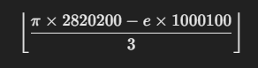

## Известный шеф-повар Поль Бокюз однажды сказал : "Жизнь - это маленькая кухня, на которой мы готовим блюда под название "счастье". На этой кухне мы сами себе шеф-повара, и только нам решать какие ингредиенты мы будем добавлять в наши блюда. Важно помнить, что универсального рецепта нет, поэтому творите. Пробуйте что-то новое. И может быть тогда, в конце, вас будет ждать награда."  

 flag{YUMMY_S3CR3TS}

 https://github.com/Jpinsoft/DeepSound/releases/download/v2.2.2404.04/DeepSound_2_2_2404_14_Setup.msi